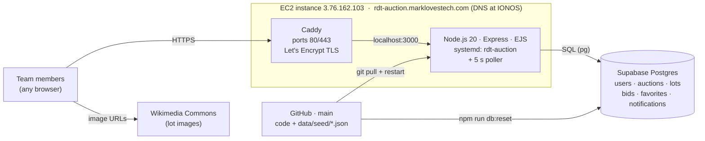

# Real Dream Team

The team's internal auction-interest app (`auction-app/`). **Live at
<https://rdt-auction.marklovestech.com>.** Everything about it is in
[`auction-app/README.md`](auction-app/README.md): how to use it, how to change
it, how to run it locally, how to reset the data, how it's deployed.

## The auction app in one minute

- Go to <https://rdt-auction.marklovestech.com>, enter the site code (hint on
  the page: your favorite otter's birthday, `YYYYMMDD`), pick your name.
- Your **summary** shows notifications, lots that match your interests, and a
  **Discover** row of five random open lots (fresh on every refresh).
- Browse **auctions** and **lots**, ★ favorite lots, place **bids** (whole
  numbers, must beat the current high bid). Being outbid puts a notification on
  your summary; your **history** lists every bid and favorite with its status.
- When an auction's close time passes (or an admin clicks *Close now*), the
  highest bid on each lot wins: SOLD ribbon, hammer price, winner, a sound, and
  Won/Lost notifications for everyone who bid.
- **/admin** (second code) lets you add lots, change close times, close/reopen
  auctions and ban/unban users.

## Architecture

Three moving parts, all always on:

Diagram source (Mermaid; re-render with `npx -p @mermaid-js/mermaid-cli mmdc -i docs/architecture.mmd -o docs/architecture.png -b white -w 1400`)

How a request flows: the browser resolves `rdt-auction.marklovestech.com`
(IONOS DNS) to the EC2 box → **Caddy** terminates TLS and proxies to the
**Node app** on `:3000` → the app runs a few SQL queries against **Supabase
Postgres** and renders the page as plain HTML (no JavaScript framework, no API
layer) → the browser fetches lot images straight from Wikimedia.

| Part | Where | Role | Managed by |
|---|---|---|---|
| Code & seed data | this repo, `main` | source of truth for the app *and* the demo data | GitHub |
| App | EC2, `rdt-auction.service` | serves pages, validates bids, runs the 5 s poller | systemd (auto-restart on boot/crash) |
| TLS / front door | EC2, Caddy `/etc/caddy/Caddyfile` | HTTPS, HTTP→HTTPS redirect, reverse proxy | Caddy (certificate renews itself) |
| Database | Supabase (hosted Postgres) | all state: users, lots, bids, notifications | Supabase; connection via `AUCTION_DATABASE_URL` in the box's `.env` |
| DNS | IONOS | `rdt-auction.marklovestech.com` → `3.76.162.103` | IONOS |

State lives only in Postgres — the Node process is stateless (the login cookie
is signed, not stored), so it can be restarted at any time without losing
anything. `npm run db:reset` (run inside `auction-app/`) wipes Postgres and reloads it from
`auction-app/data/seed/*.json`, which is how the demo is put back to a known
state (see the deploy section of `auction-app/README.md`).

## Design history

- [Build design](docs/auction-app-build-design.md) — the design the app was built
  from, with every decision recorded (§8–§9).
- [Schema reference](docs/auction-app-schema.md) · [Original V1 design](docs/auction-app-v1-design.md)
- Deferred features are GitHub issues: per-lot "Going… Going… Gone" close (#38),
  bid increments / cents (#40), category admin (#37).
