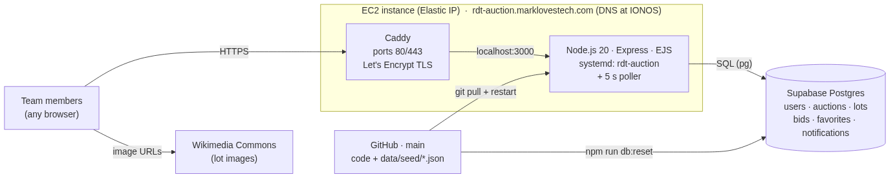

# Real Dream Team

An internal "silent auction" site for the team: everyone follows auctions,
favorites lots, bids against each other and gets notified when they are outbid
or when a lot that matches their interests appears. Lots stay open until their
auction closes; then the highest bid wins.

**Live:** <https://rdt-auction.marklovestech.com> · site code hint on the page
(your favorite otter's birthday, `YYYYMMDD`) · admin at `/admin` (second code,
hint on the page).

Plain Node.js 20 + Express + EJS templates + hand-written SQL against Supabase
Postgres. No build step, no framework magic — every page is one route file and
one template.

## The auction app in one minute

- Go to <https://rdt-auction.marklovestech.com>, enter the site code (hint on
  the page: your favorite otter's birthday, `YYYYMMDD`), pick your name.
- Your **summary** shows notifications, lots that match your interests, and a
  **Discover** row of five random open lots (fresh on every refresh).
- Browse **auctions** and **lots**, ★ favorite lots, place **bids** (whole
  numbers, must beat the current high bid). Being outbid puts a notification on
  your summary; your **history** lists every bid and favorite with its status.
- When an auction's close time passes (or an admin clicks *Close now*), the
  highest bid on each lot wins: SOLD ribbon, hammer price, winner, a sound, and
  Won/Lost notifications for everyone who bid.
- **/admin** (second code) lets you add lots, change close times, close/reopen
  auctions and ban/unban users.

Admins can manage categories at `/admin/categories`, including renaming, ordering,
retiring, and finding likely lots to move. Run `npm run db:check` after applying
migration 003 to report any lot or preference names that do not match a category.

## Architecture

Three moving parts, all always on:



<details><summary>Diagram source (Mermaid; re-render with `npx -p @mermaid-js/mermaid-cli mmdc -i docs/architecture.mmd -o docs/architecture.png -b white -w 1400`)</summary>


</details>

How a request flows: the browser resolves `rdt-auction.marklovestech.com`
(IONOS DNS) to the EC2 box → **Caddy** terminates TLS and proxies to the
**Node app** on `:3000` → the app runs a few SQL queries against **Supabase
Postgres** and renders the page as plain HTML (no JavaScript framework, no API
layer) → the browser fetches lot images straight from Wikimedia.

| Part | Where | Role | Managed by |
|---|---|---|---|
| Code & seed data | this repo, `main` | source of truth for the app *and* the demo data | GitHub |
| App | EC2, `rdt-auction.service` | serves pages, validates bids, runs the 5 s poller | systemd (auto-restart on boot/crash) |
| TLS / front door | EC2, Caddy `/etc/caddy/Caddyfile` | HTTPS, HTTP→HTTPS redirect, reverse proxy | Caddy (certificate renews itself) |
| Database | Supabase (hosted Postgres) | all state: users, lots, bids, notifications | Supabase; connection via `AUCTION_DATABASE_URL` in the box's `.env` |
| DNS | IONOS | `rdt-auction.marklovestech.com` → EC2 Elastic IP | IONOS |

State lives only in Postgres — the Node process is stateless (the login cookie
is signed, not stored), so it can be restarted at any time without losing
anything. `npm run db:reset` wipes Postgres and reloads it from
`data/seed/*.json`, which is how the demo is put back to a known
state (see the deploy section below).


## Using the app

| Page | What you do there |
|---|---|
| `/enter` | Enter the site code; you are remembered until you close the browser (or click **Sign out** in the top bar, which forgets both the site and admin codes). |
| `/` | Pick your name. Everything after this is under `/u/<your id>/…`. |
| **Summary** `/u/:id/summary` | Your home page. **Matches your interests** — open lots matching your preferences, each with a chip saying *why* it matched. **Discover** — five random open lots you haven't bid on or favorited, different on every refresh (*Shuffle*). Everyone gets Discover, even with no preferences. |
| **Preferences** `/u/:id/preferences` | Tick categories (fixed list, see `lib/categories.js`), type artists and keywords (comma-separated). Optional — it only sharpens Matches. |
| **Auctions** `/u/:id/auctions` | All auctions grouped Open / Upcoming / Closed, with lot counts. Click through to the auction's lots. |
| **Lot** `/u/:id/lots/:lotId` | Images, estimate, link to the source page, ★ favorite toggle, the bid form and the full bid history (newest first). Bids use units of the lot's currency, up to two decimals, stored in `NUMERIC(16,2)`, and must beat the current high bid (or meet the starting bid on the first bid). You can bid again after being outbid. Closed lots show SOLD, hammer price and winner (the `sold.mp3` sound plays on `/admin` right after Close now). |
| **History** `/u/:id/history` | Every bid you've placed with its state — Winning / Outbid / Won / Lost — and your favorites. |
| **Admin** `/admin` | Table of auctions with editable close time (US Central), *Close now* / *Reopen*; add a lot to any auction (matching users get a notification); ban / unban users (banned users can't bid, nothing is deleted) |

The right-hand **Open auctions** and **Notifications** panes appear on every
page and refresh every 3 seconds. The Summary page contains Matches and
Discover; its notification feed lives in the right-hand pane.

How closing works: a poller runs every `POLL_SECONDS` (5 s). It flips
`upcoming` auctions to `open` when `starts_at` passes and closes `open`
auctions when `closes_at` passes. Closing an auction (poller or *Close now*)
takes the highest bid on each lot (earliest bid wins a tie), sets hammer price
and winner, and sends a `sold` notification to every bidder. *Reopen* clears
the results but keeps all bids, and pushes `closes_at` forward if it is in the
past.

## Changing the app

```
server.js            starts Express, mounts routes, starts the poller
routes/*.js          one file per page: summary, preferences, auctions, lots, history, admin
views/*.ejs          the matching HTML template for each page; partials/lot-card.ejs is the lot tile
lib/matching.js      "does this lot match these preferences?" (category | artist | keyword)
lib/bids.js          bid validation + placing a bid (transaction, row lock, outbid notification)
lib/close.js         close / reopen an auction, pick winners, sold notifications
lib/new-lot.js       admin add-lot validation + new_lot notifications
lib/poller.js        the 5 s status poller
lib/categories.js    the default category seed/fallback list
lib/notifications.js feed queries, unread count, mark-all-read
public/styles.css    all styling; public/sold.mp3 the sale sound
db/schema.sql        the 10 tables; db/db.js the pool, transactions and seed loader
data/seed/*.json     the demo data (see "Seed contract")
```

Typical edits: change wording → the `.ejs` file for that page; change a rule
(minimum bid, who gets notified) → the `lib/` file named for it; change the
look → `public/styles.css`. Run `npm test` after touching `lib/`, `routes/` or
`db/` (see "Testing").

## Testing

Tests use Node's built-in `node:test` runner; there are no test dependencies.

```sh
npm test               # everything: unit + database + HTTP
npm run test:unit      # pure-function tests only, no database needed (< 1 s)
npm run test:integration
```

Three tiers:

```
lib/*.test.js, db/db.test.js, routes/helpers.test.js
                     unit tests next to the module they cover; no I/O
test/integration/    lib/ modules that talk to PostgreSQL (bids, close, new-lot,
                     category-admin, notifications, panes, poller, seed loader)
test/http/           the real Express app on an ephemeral port, driven with
                     fetch: gates, cookies, rate limits, pages, redirects
```

The database and HTTP tiers need a dedicated test database, named by
`AUCTION_TEST_DATABASE_URL` (default `postgres://postgres@localhost:5433/rdt_test`).
They truncate every table before each case, so never point it at `rdt_local`
or Supabase. When the test database is unreachable those cases are reported
as `# SKIP no test database (...)` instead of failing, so `npm test` is safe
anywhere. To create it:

```sh
createdb -p 5433 rdt_test
psql -p 5433 -d rdt_test -f db/schema.sql
```

`test/db-helper.js` holds the fixtures (`createAuction`, `createLot`,
`createBid`, …) and `test/http-helper.js` a tiny cookie-keeping `Client`; add
new cases with `describeDb` / `describeHttp` from those files.

## Run locally

```sh
cp .env.example .env
npm install
npm run db:reset
npm start
```

Open <http://localhost:3000>. The default site code is `20240312`; the
default admin code is `20250714`.

For the local PostgreSQL 14 database used during development:

```sh
createdb -p 5433 rdt_local
psql -p 5433 -d rdt_local -f db/schema.sql
```

Set `AUCTION_DATABASE_PASSWORD` in `.env` when the local PostgreSQL role
requires a password. Do not point local verification at the shared Supabase
database.

Before running `db:reset` against Supabase, apply every migration in
`db/migrations/`; migrations `001-schema-review.sql`, `002-bigint-money.sql`,
`003-decimal-money.sql`, `003-categories.sql`, `004-avatars.sql`, and
`005-rename-stuffed-animals.sql` are required.
Money columns use `NUMERIC(16,2)` to support values up to 9,999,999,999,999.99.
On an existing database,
follow `004-avatars.sql` with `npm run db:avatars` to give every user a default icon.

### Safety

Some environments pre-inject the shared Supabase connection variables. The
application loads `.env` with override enabled, so the values in `.env` win.
`db:reset` refuses remote database hosts unless you explicitly confirm the
operation. Before a deliberate remote reset, use:

```sh
ALLOW_REMOTE_RESET=1 npm run db:reset
```

### Security

- Site and admin code prompts allow 10 failed attempts per IP per 15 minutes.
- Gate cookies are signed, `httpOnly`, `SameSite=Lax`, and secure in production.
- Production requires `COOKIE_SECRET`, `ACCESS_CODE`, and `ADMIN_CODE`.
- Admin source and image URLs accept only `http://`, `https://`, or site-relative `/` paths.

## Reset

`npm run db:reset` truncates the ten application tables, resets identity
sequences, and loads the seed contract in one transaction. It is safe to run
repeatedly.

## Environment

- `AUCTION_DATABASE_URL`: PostgreSQL connection string.
- `AUCTION_DATABASE_PASSWORD`: password passed separately to `pg.Pool`.
- `AUCTION_TEST_DATABASE_URL`: database used instead of `AUCTION_DATABASE_URL`
  when `NODE_ENV=test` (the test runner sets this); default
  `postgres://postgres@localhost:5433/rdt_test`.
- `ACCESS_CODE`: site-wide access code, default `20240312`.
- `ADMIN_CODE`: admin access code, default `20250714`.
- `POLL_SECONDS`: interval used by the lightweight poller, default `5`.
- `SIM_ENABLED`: run the auction-house simulator, default `true` (tests force `false`).
- `SIM_MIN_SECONDS` / `SIM_MAX_SECONDS`: jittered delay between simulated actions, defaults `5` / `30`.
- `SIM_IDLE_SECONDS`: how long without a pane heartbeat counts as "nobody online", default `90`.
- `SIM_IDLE_CHECK_SECONDS`: how often the simulator re-checks presence while asleep, default `30`.
- `SIM_MIN_OPEN_AUCTIONS`: keep at least this many auctions open by pulling the next upcoming sale forward, default `3`.
- `SIM_MIN_UPCOMING_AUCTIONS`: keep at least this many upcoming auctions by cloning a closed one forward, default `1`.
- `PORT`: HTTP port, default `3000`.
- `COOKIE_SECRET`: secret used to sign access cookies, default `change-me`.

## Simulation

The site can run a "living auction house" simulator: hidden shadow users bid,
favorite and respond to outbids so the site feels busy while someone is
looking at it. It only acts while at least one browser is polling the panes
(presence = the existing 3 s `/panes/*` poll), caps itself at 300 actions an
hour, and serialises across processes with a Postgres advisory lock. The
`/admin` page has a Simulation box: on/off, run-one-action-now, and a
"wake for 10 min" button for demos. Design and rationale:
[`docs/simulation-design.md`](docs/simulation-design.md).

## Seed contract

The data phase supplies these files in `data/seed/`:

- `users.json`: an array of `{name, email, avatar_url?, banned, preferences?}`.
  When `avatar_url` is omitted the loader assigns a default icon from
  `public/avatars/defaults/` (Noto Emoji, Apache 2.0): animals, places and objects,
  least-used first so everyone gets a distinct one. Uploaded pictures are stored in
  `users.avatar_data` (BYTEA) and served at `/avatars/:userId`.
  A preference object has `categories`, `artists`, and `keywords` arrays.
  A `preferences` row is created only when that property is present.
- `preferences.json`: `{user, categories, artists, keywords}` objects for
  users whose preferences are stored separately from `users.json`.
- `auction_houses.json`: `{name, location, website, logo_url}` objects.
- `auctions.json`: `{house, house_ref, title, location, format, starts_at,
  closes_at, source_url}` objects. `house` is the exact house name and dates
  are absolute ISO 8601 timestamps. The loader computes `status` from them.
- `lots.json`: `{house, house_ref, lot_number, title, artist, category,
  description, currency, estimate_low, estimate_high, starting_bid,
  hammer_price, winner, source_url, images}` objects. `hammer_price` and
  `winner` are optional closed-lot result fields. Each image is
  `{url, credit}` and is stored in its array order.

The loader uses natural keys rather than fixture IDs: users by `name`, houses
by `name`, auctions by `(house, house_ref)`, and lots by
`(house, house_ref, lot_number)`. PostgreSQL assigns all numeric IDs. Lot
categories must be one of the values exported by `lib/categories.js`.

Optional activity files may also be supplied:

- `bids.json`: `{house, house_ref, lot_number, user, amount, placed_at}`.
- `favorites.json`: `{user, house, house_ref, lot_number}`.
- `notifications.json`: `{user, house, house_ref, lot_number, kind, reason,
  created_at, read_at}`. Duplicate `(user, lot, kind)` rows are
  ignored.
- `shadow_users.json`: `{name, email?, avatar_url?, banned?, persona,
  preferences}` objects — simulated bidders, loaded with `shadow = true` so
  they are hidden from the profile picker and never receive notifications.
  `persona` is simulator tuning `{budget, aggression, sniper, activity}`;
  `preferences` (`{categories, artists, keywords}`) always produces a
  preferences row.

Unknown natural keys and invalid categories fail the transaction with a clear
error. This seed shape is the contract for the data-phase session.

## Deploy (EC2)

The production demo runs on the `rdt-auction` EC2 host (address, SSH user and
access details are in the private Devin knowledge note "RDT infrastructure
access"; the SSH key is the `RDT_EC2_SSH_KEY` secret) from
`/opt/rdt/realdreamteam`, using the shared Supabase PostgreSQL
database. The `rdt-auction.service` systemd unit runs the app with its settings
in the mode-600 `.env` file.

To update the checkout on the server:

```sh
cd /opt/rdt/realdreamteam
git pull
npm ci --omit=dev
sudo systemctl restart rdt-auction
```

Check the service and recent logs with:

```sh
sudo systemctl status rdt-auction
journalctl -u rdt-auction -n 50 --no-pager
```

Caddy (`/etc/caddy/Caddyfile`) terminates TLS for
<https://rdt-auction.marklovestech.com> (Let's Encrypt, auto-renew) and
proxies to `:3000`; DNS A record at IONOS. Do not run `db:reset` on the
production host.

## Design history

- [Build design](docs/build-design.md) — the design the app was built
  from, with every decision recorded (§8–§9).
- [Schema reference](docs/schema.md) · [Original V1 design](docs/v1-design.md)
- Deferred features are GitHub issues: per-lot "Going… Going… Gone" close (#38),
  bid increments / cents (#40), category admin (#37).
