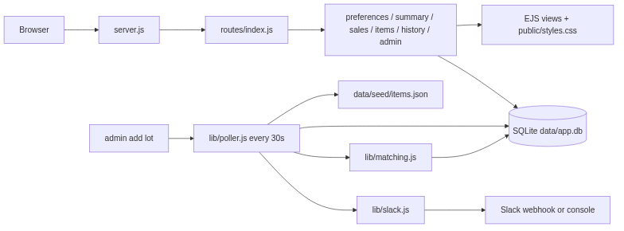
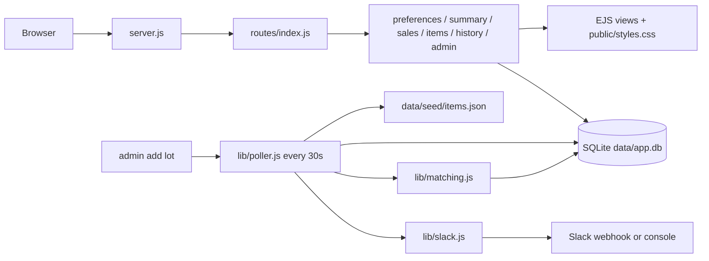
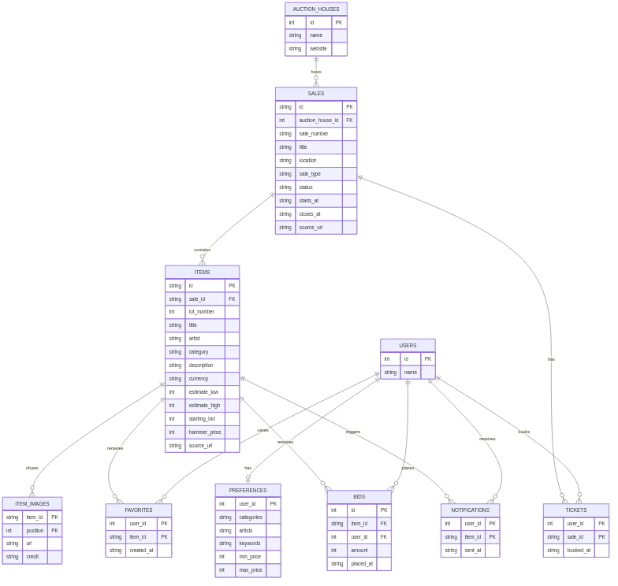
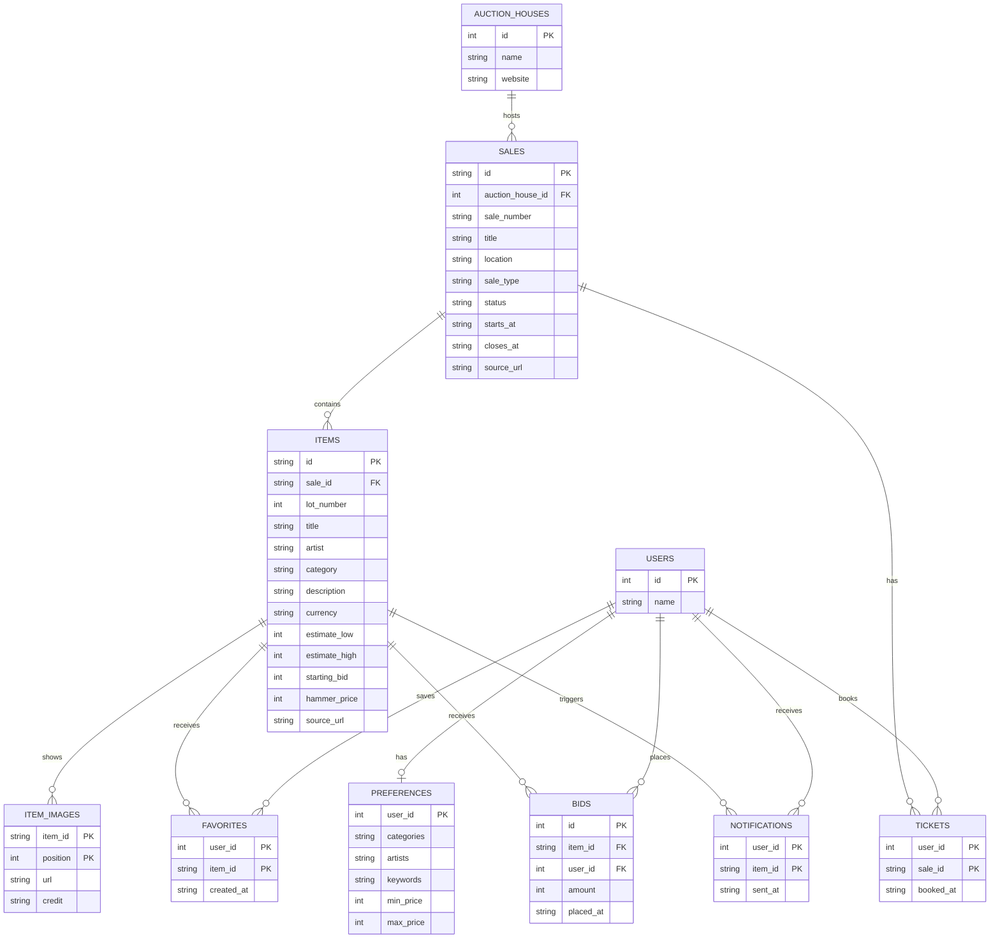

# Auction app architecture

```mermaid
flowchart LR
  Browser --> Server[server.js]
  Server --> Routes[routes/index.js]
  Routes --> Pages[preferences / summary / sales / items / history / admin]
  Pages --> Views[EJS views + public/styles.css]
  Pages --> DB[(SQLite data/app.db)]
  Poller[lib/poller.js every 30s] --> Seed[data/seed/items.json]
  Poller --> DB
  Poller --> Matching[lib/matching.js]
  Matching --> DB
  Poller --> Slack[lib/slack.js]
  Slack --> Webhook[Slack webhook or console]
  Admin[admin add lot] --> Poller
```

```mermaid
erDiagram
  AUCTION_HOUSES ||--o{ SALES : hosts
  SALES ||--o{ ITEMS : contains
  ITEMS ||--o{ ITEM_IMAGES : shows
  USERS ||--o| PREFERENCES : has
  USERS ||--o{ FAVORITES : saves
  ITEMS ||--o{ FAVORITES : receives
  USERS ||--o{ BIDS : places
  ITEMS ||--o{ BIDS : receives
  USERS ||--o{ TICKETS : books
  SALES ||--o{ TICKETS : has
  USERS ||--o{ NOTIFICATIONS : receives
  ITEMS ||--o{ NOTIFICATIONS : triggers
  AUCTION_HOUSES { int id PK
    string name
    string website
  }
  USERS { int id PK
    string name
  }
  PREFERENCES { int user_id PK
    string categories
    string artists
    string keywords
    int min_price
    int max_price
  }
  SALES { string id PK
    int auction_house_id FK
    string sale_number
    string title
    string location
    string sale_type
    string status
    string starts_at
    string closes_at
    string source_url
  }
  ITEMS { string id PK
    string sale_id FK
    int lot_number
    string title
    string artist
    string category
    string description
    string currency
    int estimate_low
    int estimate_high
    int starting_bid
    int hammer_price
    string source_url
  }
  ITEM_IMAGES { string item_id PK
    int position PK
    string url
    string credit
  }
  FAVORITES { int user_id PK
    string item_id PK
    string created_at
  }
  BIDS { int id PK
    string item_id FK
    int user_id FK
    int amount
    string placed_at
  }
  TICKETS { int user_id PK
    string sale_id PK
    string booked_at
  }
  NOTIFICATIONS { int user_id PK
    string item_id PK
    string sent_at
  }
```
