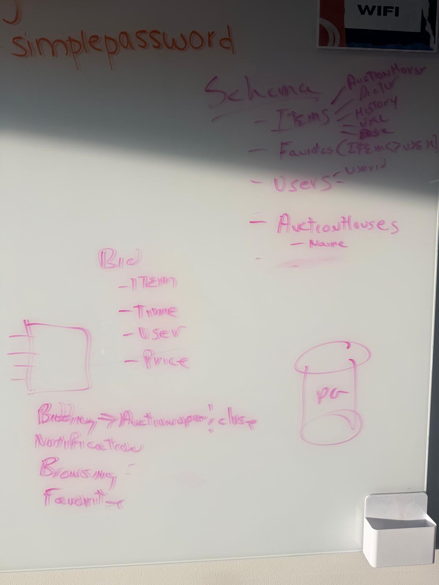

# Auction Interest App — V1 Data Model

Status: **final** (agreed table by table with Mark, 2026-09-15) and **applied to the Supabase
Postgres database**. The DDL with every table and column comment is
[`auction-app/db/schema.sql`](../auction-app/db/schema.sql); this page explains it.

Guiding rule: **simple enough for non-technical teammates to read and edit.** Nine tables,
integer ids everywhere, no application code until this model is stable.

## Naming

"Sale" is auction-house jargon and collides with the everyday meaning (a closed transaction),
so we use plain words:

| Concept | Table | Was |
|---|---|---|
| The company running auctions | `auction_houses` | same |
| A scheduled auction event | `auctions` | `events` (v1), `sales` (v2) |
| One item offered in an auction | `lots` | `items` |
| Photos of a lot | `lot_images` | `item_images` |
| The ♥ | `favorites` | `likes` |
| An offer on a lot | `bids` | same |
| A user | `users` | same |
| What a user is looking for | `preferences` | same |
| "We told this user about this lot" | `notifications` | same |

## Tables

| Table | One row is… | Key columns |
|---|---|---|
| `auction_houses` | Sotheby's, Christie's, Phillips, Bonhams | `name`, `location`, `website`, `logo_url` |
| `users` | a demo account (no login) | `name`, `email`, `avatar_url`, `banned` |
| `preferences` | one user's interests (1:1 with users) | `categories[]`, `artists[]`, `keywords[]` — empty array = any |
| `auctions` | an auction run by one house | `house_ref`, `title`, `location`, `format` (live/timed), `status` (upcoming/open/closed), `starts_at`, `closes_at`, `source_url` |
| `lots` | an item in an auction | `lot_number`, `title`, `artist`, `category`, `description`, `currency`, `estimate_low/high`, `starting_bid`, `hammer_price`, `winner_user_id`, `source_url` |
| `lot_images` | one photo of a lot, ordered | `position` (1 = thumbnail), `url`, `credit` |
| `favorites` | user ♥ lot | `created_at` |
| `bids` | one bid, append-only | `lot_id`, `user_id`, `amount`, `placed_at` |
| `notifications` | one (user, lot) match to deliver to Slack | `reason`, `created_at`, `sent_at` (NULL = pending) |

Every table and column carries a `COMMENT` in the database, so the Supabase table editor
shows the same explanations.

## Rules the app enforces (in code, not the DB)

- **Auction status is automatic.** The poller flips `upcoming → open` when `starts_at`
  passes and `open → closed` when `closes_at` passes. At close it sets `lots.hammer_price`
  and `lots.winner_user_id` from the high bid. No admin page flips status by hand.
- **Anyone can bid in any open auction.** A bid is accepted only if the auction is `open`,
  the user is not `banned`, and `amount` beats `MAX(bids.amount)` for the lot (or
  `starting_bid`, falling back to `estimate_low`, if there are no bids yet).
- **Current bid is never stored.** Current bid = `MAX(amount)`, bid count = `COUNT(*)`,
  high bidder = user of the max row.
- **Matching** = a lot hits any of the user's `categories`, `artists`, or `keywords`
  (keywords checked against title and description). No price filtering.
- **Notify once.** `notifications` is unique on (user, lot); the poller delivers rows with
  `sent_at IS NULL` and stamps `sent_at` on success.

## Files and images

Logos, avatars, and lot photos live in Supabase Storage buckets `logos`, `avatars`, and
`lots`; the tables store the public URLs.

## Seed data (to do)

The seed files under `auction-app/data/seed/` still have the v2 shape and must be regenerated.
When we do, dates are **relative to now** so the demo works whenever it runs: one auction
already `closed` (with hammer prices and winners for the history page), one `open` (where
bidding happens), one or two `upcoming` (so the matcher has lots to notify about).

## Dropped from earlier drafts

- `tickets` — no reservation needed to bid; everyone may take part in every auction.
- `preferences.min_price / max_price` — no budget filtering in V1.
- `users.slack_user_id` — notifications go to one Slack channel.
- Explicit indexes — primary keys and UNIQUE constraints are enough at demo scale.

## Left out on purpose

Bidding features deliberately deferred are tracked as GitHub issues under the
[`deferred-bidding`](https://github.com/COG-GTM/realdreamteam/issues?q=label%3Adeferred-bidding)
label: proxy/max bids, bid increments, reserves, room/phone/absentee bidding, bidder
registration, a separate closed-sale history table, realtime bid updates. Also still out:
condition reports, provenance, viewing schedules, an artist entity table, saved searches.

## Sources (auction-house pages inspected for v2)

- Sotheby's — [Napa Valley Fine Wine Auction](https://www.sothebys.com/en/buy/auction/2026/napa-valley-fine-wine-auction?showDetails), [Lot 4001](https://www.sothebys.com/en/buy/auction/2026/napa-valley-fine-wine-auction/napa-valley-vintners-the-best-of-napa-valley-in)
- Christie's — [Sale 24434 overview](https://www.christies.com/en/auction/auction-24434-cks/overview), [Lot 1](https://www.christies.com/en/lot/lot-6598670)
- Phillips — [UK030426](https://www.phillips.com/auction/UK030426), [Lot 221](https://www.phillips.com/detail/david-hockney/UK030426/221)
- Bonhams — [Auction 32587](https://www.bonhams.com/auction/32587/the-sandy-lerner-cat-collection-part-i/), [Lot 11](https://www.bonhams.com/auction/32587/lot/11/henriette-ronner-knip-dutch-1821-1909-a-fluffy-white-cat/)
