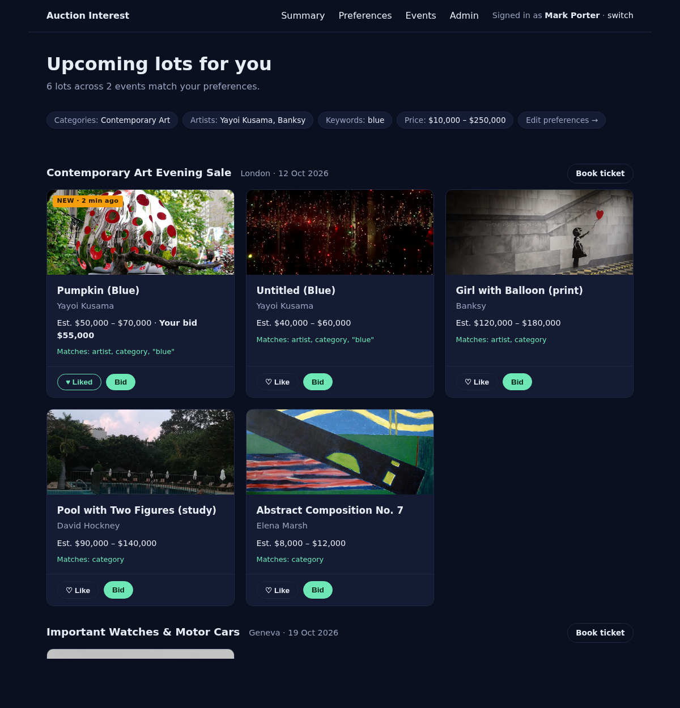

# Auction Interest App — v1 Design (Proposal)

Status: proposal for team review. Decisions marked **Decided** were confirmed in the design
session; everything else is a default chosen for simplicity and can be changed before build starts.

## Goals for v1

- A non-technical team member can run it with two commands and understand every file.
- One deployable thing. No build step, no separate services; the only external dependency is the Supabase Postgres database.
- Every feature from the original plan is present in its simplest form.

## Decisions

| Topic | Decision | Why |
|---|---|---|
| Stack | **Decided:** Node + Express, server-rendered HTML (EJS templates) | Plain files, no compiler, `npm start` and it runs |
| Auth | **Decided:** no login — pick your name from a dropdown of seeded users | Removes passwords, sessions, email |
| Auction data | Seeded JSON fixtures (`data/seed/*.json`) loaded into Postgres on first start — **seed files still need regenerating to the new schema, with dates relative to "now"** | Editable in any text editor |
| Triggering a "new lot" | An `/admin` page with an "Add lot to auction" form | Deterministic demo of the notification flow |
| Ingestion / scheduler | A `setInterval` inside the app that re-reads `data/seed/lots.json` every 30s and inserts any lot IDs it hasn't seen | No cron, no queue; editing the JSON file *is* the auction site publishing a lot |
| Matching | Plain function: lot matches if category or artist is in the user's list, or a keyword appears in the title | Readable in one screen |
| Slack | Single incoming webhook URL from `.env`; one channel, message names the user | No bot token, no OAuth, no user-ID mapping |
| Database | **Decided:** Supabase Postgres; schema in `db/schema.sql` (already applied to the Supabase project). App connects via `AUCTION_DATABASE_URL` / `AUCTION_DATABASE_PASSWORD` | Shared, real database; no local file to manage |
| Styling | One `public/styles.css`; no framework | Same approach as this site |
| Demo hosting | **Decided:** run locally on the presenter's laptop (`npm start`). GitHub Pages only serves the static site in `src/` and cannot run Node *(historical — the static site and Pages workflow were removed in #57 and the app now lives at the repo root, #60)* | Zero deploy risk for the demo |
| Location in repo | **Decided:** `auction-app/` at the repo root, next to `src/` (the existing static site). The Pages workflow only uploads `src/`, so the app is never published as static files *(historical — the static site and Pages workflow were removed in #57 and the app now lives at the repo root, #60)* | Keeps the two things separate |

## Repo layout

```
  package.json          # express, ejs, pg, dotenv
  server.js             # starts Express, runs seed, starts poller
  .env.example          # SLACK_WEBHOOK_URL=  APP_BASE_URL=http://localhost:3000
  db/
    schema.sql          # CREATE TABLE statements (below)
    db.js               # connect to Postgres (pg), seed if empty
  data/
    seed/users.json
    seed/auction_houses.json
    seed/auctions.json
    seed/lots.json      # edit this to "publish" new lots; each lot has an images array
  lib/
    matching.js         # matchesPreferences(lot, prefs) -> boolean
    slack.js            # notifyNewLot(user, lot, auction)
    poller.js           # every 30s: read lots.json, insert new, notify matches
  routes/
    index.js            # mounts every router below; GET / pick user
    preferences.js      # GET/POST /u/:userId/preferences
    summary.js          # GET /u/:userId/summary
    history.js          # GET /u/:userId/history
    auctions.js         # GET /auctions, GET /auctions/:id
    lots.js             # GET /lots/:id, POST .../favorite, POST .../bid
    admin.js            # GET/POST /admin/lots
  views/                # one .ejs per route above + layout.ejs
  public/styles.css
```

Directory ownership for parallel work: one workstream per file in `lib/` and `routes/`
(+ its view). `db/schema.sql` and `data/seed/` are frozen after milestone 1.

Milestone 1 creates every file in `lib/` and `routes/` as a stub and mounts all routers from
`routes/index.js`, so `server.js` and `routes/index.js` are never touched again. Later PRs
only fill in their own file and view.

## Schema (`db/schema.sql`)

Schema lives in [`schema.md`](schema.md).


## Seed data (`data/seed/`)

Seed files are generated and loaded on first start — the planned content:

| File | Contents |
|---|---|
| `users.json` | 6 team members, each with pre-filled `preferences` so the summary page is non-empty on first run |
| `auction_houses.json` | 4 auction houses with IDs, names, and website roots |
| `auctions.json` | 3 auctions: London (art), Geneva (watches & cars), New York (wine, books, design) — one closed, one open, one or two upcoming, with `starts_at`/`closes_at` relative to seed time |
| `lots.json` | 18 lots across those auctions; each has an `images` array with Wikimedia Commons credits |

> Note: the seed files still need regenerating to the new schema shape (renamed tables/columns,
> dates relative to "now"). The table above describes the intended content.

Lot shape:

```json
{ "id": "lot-101", "auctionId": "ev-2026-10-london", "lotNumber": 1,
  "title": "Untitled (Blue)", "artist": "Yayoi Kusama", "category": "Contemporary Art",
  "description": "Acrylic on canvas, 2019, 130 × 162 cm", "currency": "GBP",
  "estimateLow": 40000, "estimateHigh": 60000, "startingBid": 40000,
  "sourceUrl": null,
  "images": [{ "url": "https://upload.wikimedia.org/...",
               "credit": "CC BY-SA 4.0, Wikimedia Commons" }] }
```

Categories used (drive the preferences checkboxes): Contemporary Art, Photography, Watches,
Cars, Jewellery, Wine & Spirits, Design, Books & Manuscripts.

Adding an object to `lots.json` (or using `/admin`) is how the team triggers a Slack notification.

## Demo golden path (must work)

1. Open `http://localhost:3000`, pick **Mark Porter**.
2. Summary shows Kusama / Banksy lots from the London auction already matched.
3. Open `/admin/lots`, add a lot: title "Pumpkin (Blue)", artist "Yayoi Kusama", category
   "Contemporary Art", 50,000–70,000, auction London.
4. Slack channel (or the console, if no webhook) shows "New lot for Mark Porter …".
5. Back on the summary, Favorite it, then Bid 55,000.
6. Open `/u/1/history`: the favorite and the $55,000 bid are listed.

Everything else is nice-to-have for the demo.

## Pages (all server-rendered)

| URL | What the user sees |
|---|---|
| `/` | "Who are you?" dropdown → redirects to `/u/:id/summary` |
| `/u/:id/preferences` | Form: categories (checkboxes), artists (text, comma-separated), keywords |
| `/u/:id/summary` | "Upcoming lots for you": matching lots grouped by auction, with Favorite / Bid buttons |
| `/u/:id/history` | "Your activity": two lists — lots you favorited, bids you placed (amount, time, whether you're still the high bidder) — newest first. Read-only; data comes from `favorites`, `bids` |
| `/auctions` , `/auctions/:id` | All upcoming and open auctions and their lots |
| `/lots/:id` | Lot detail, current high bid, bid form |
| `/admin/lots` | Form to add a lot to an auction (the demo trigger) |

## Poller and notifications

Every 30s `lib/poller.js`:

1. Reads `lots.json`, inserts rows whose `id` is not yet in `lots`.
2. For each new lot and each user whose preferences match, inserts a `notifications` row
   with `sent_at = NULL` in the same transaction.
3. Selects all `notifications WHERE sent_at IS NULL`, posts each to Slack, and sets `sent_at`
   on success. A failed post stays `NULL` and is retried on the next tick.

The poller also flips each auction's status (`upcoming`/`open`/`closed`) from `starts_at`/`closes_at`
on every tick — there is no manual admin open/close.

The `/admin/lots` form does steps 2–3 immediately after inserting.

## Slack message

```
New lot for Mark Porter: "Untitled (Blue)" by Yayoi Kusama
Contemporary Art · est. $40,000–$60,000 · London, 12 Oct 2026
https://<APP_BASE_URL>/lots/lot-101
```

Sent via `POST SLACK_WEBHOOK_URL` with `{ "text": "..." }`. Links are built from
`APP_BASE_URL` (default `http://localhost:3000`). If `SLACK_WEBHOOK_URL` is unset, log to
console instead so the app runs without Slack.

## Running it

```
cp .env.example .env      # optionally paste a Slack webhook URL
npm install
npm start                 # http://localhost:3000
```

## Build order

1. `package.json`, `server.js`, `db/`, seed files, `/` page, stub files for every router and
   `lib/` module, all mounted in `routes/index.js` — one PR, lands first.
2. Preferences page + `lib/matching.js` + summary page.
3. Auctions/lots pages with Favorite / Bid, plus the history page.
4. `lib/poller.js` + `lib/slack.js` + `/admin/lots`.
5. README (run-locally instructions). No deploy step for the demo; a hosted target is tracked in #10.

Each step is one PR on its own branch. Steps 2–4 can be built in parallel once step 1 is merged.

## Deliberately left out of v1

Real login, per-user Slack DMs, scraping a real auction site, a separate mock service, a
frontend framework, background job queues, tests beyond `lib/matching.js`, manual admin
open/close of auctions (automatic via `starts_at`/`closes_at`). Other deferred bidding
features are tracked in the
[deferred-bidding issues](https://github.com/COG-GTM/realdreamteam/issues?q=label%3Adeferred-bidding).

## Mockup

Static mockup of `/u/:id/summary` after the golden path: [`docs/mockup-summary.html`](mockup-summary.html) (open it in a browser). Builders should copy its layout and CSS into `views/summary.ejs` and `public/styles.css`.


